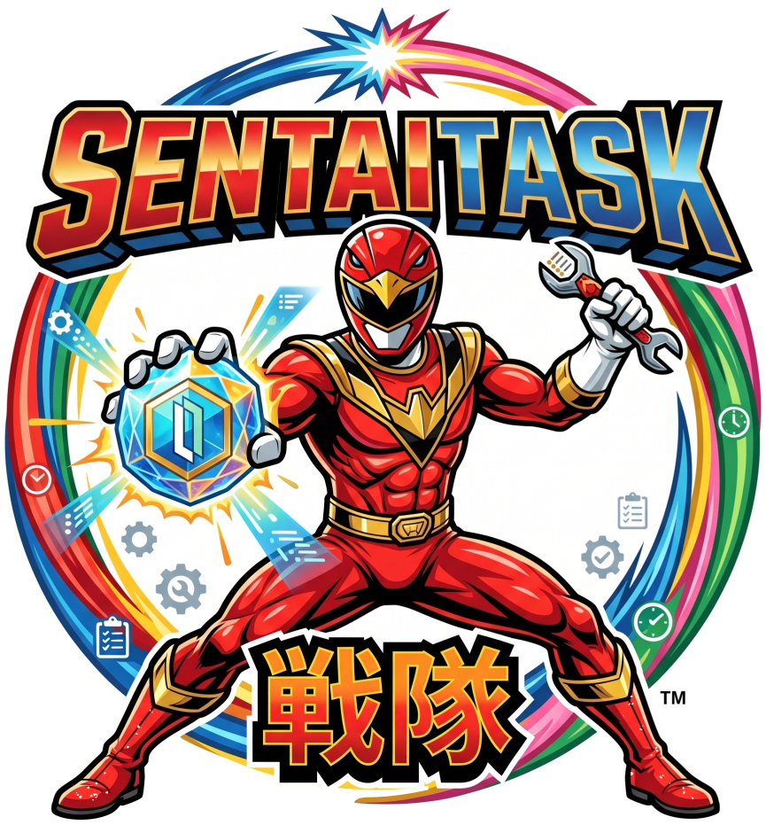
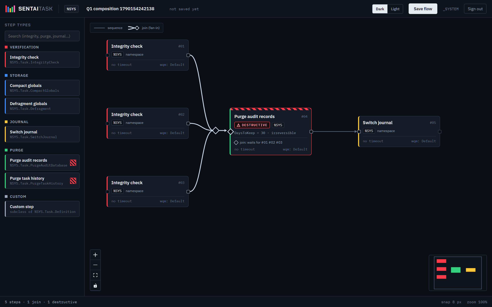
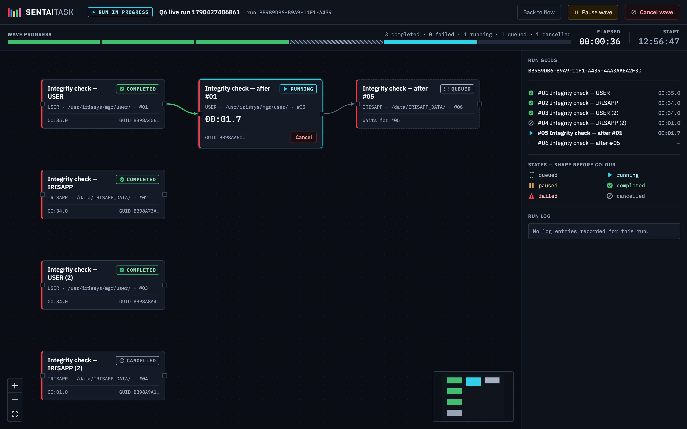
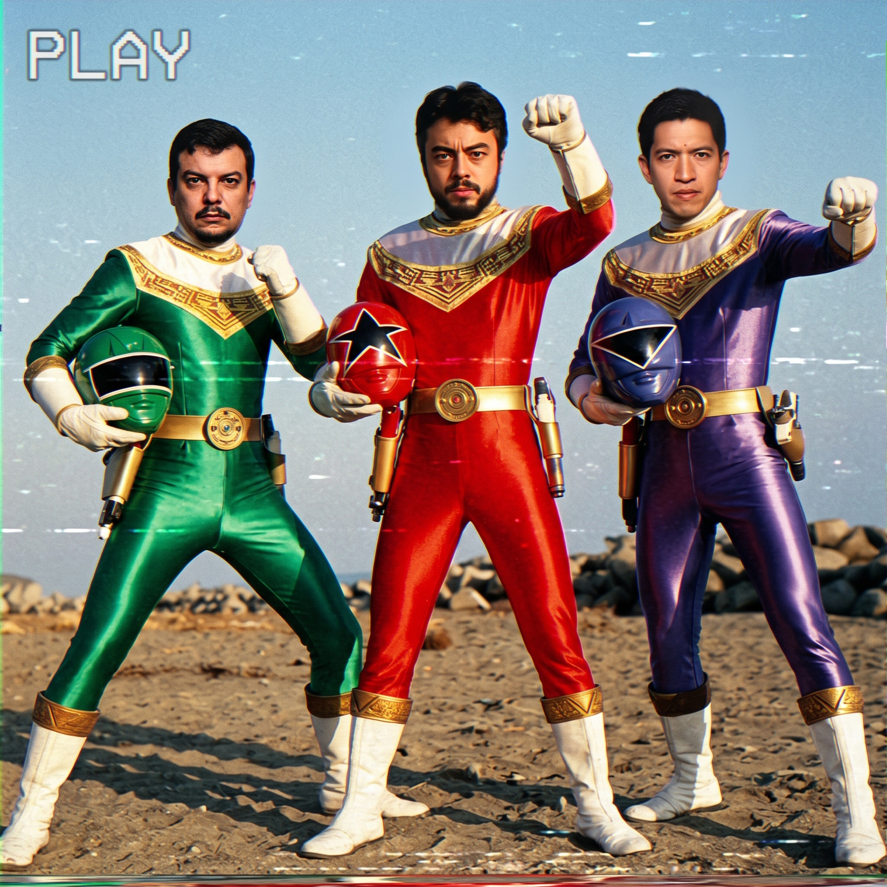

[](https://openexchange.intersystems.com/package/sentai-task)
[](LICENSE)
[](https://www.intersystems.com/)
[](https://docs.intersystems.com/)

<p align="center">
  
</p>

# 🦸 SentaiTask 戦隊

**Visual orchestration for InterSystems IRIS maintenance tasks**

> *Every task a squad member. Every flow a coordinated attack.*

---

## 🌌 Motivation

IRIS maintenance jobs such as integrity checks, journal switches, purges and compaction are
usually scheduled one at a time in the Task Manager. Their order, their dependencies and "what
happens if one fails" are kept in someone's head or in a runbook.

**SentaiTask** turns that tacit knowledge into a declared, validated, observable flow:

- ✅ **Compose** a flow as a graph: steps run in parallel waves and fan in at join points.
- ✅ **Validate before running**: cycles, unknown or unsupported step types, missing parameters,
  missing namespaces, unknown WQM categories, read-only databases.
- ✅ **Dispatch and track**: every step becomes a platform job with its own GUID, state and
  verbatim failure reason, followed live on the canvas (the API also streams it over
  Server-Sent Events).
- ✅ **Stay honest**: the product only offers what the target IRIS instance was proven to do (see
  [Known limitations](#%EF%B8%8F-known-limitations-v1)).

Like a *sentai* squad, each step has its own role, and the flow decides when they move together.

---

## 🛠️ How It Works

SentaiTask is an ObjectScript backend on top of the IRIS management API (`/api/admin`), plus a
canvas UI that IRIS serves itself. It does not reimplement the platform's permissions: every
platform call is made with the operator's own credential (Constitution III, *Delegated
Authorization*).

### Core pieces

1. **Flow model** (`sentai.model`): Flow, Step, Edge, Join, Run, StepRun and LogEntry, persisted
   in IRIS. Edges are acyclic and fan-in joins use `ALL_MUST_SUCCEED`.
2. **Step-type registry** (`sentai.registry.StepType`): a closed, compiled catalog. No code is ever
   taken from input. Each type declares whether it is destructive, pausable and **available on the
   target platform**.
3. **Validator** (`sentai.validation.FlowValidator`): a single gate shared by validate, dispatch
   and schedule, so a flow that fails `/validate` can never be run.
4. **Wave dispatcher** (`sentai.dispatch.WaveDispatcher`): creates the Run and one StepRun per
   step in a single transaction, enqueues eligible steps on the step's WQM category, starts the
   platform job and follows it to a terminal state.
5. **REST API + SSE** (`sentai.rest.Dispatcher`): `/csp/sentai/api/v1`, with password + JWT
   authentication and no unauthenticated access.
6. **Canvas UI** (`frontend/`): SvelteKit + Svelte Flow, compiled to static files in a Node stage
   of the `Dockerfile` and served by IRIS's own web server at `/csp/sentai/` through
   `sentai.web.StaticFiles`, behind the IRIS password (no unauthenticated web app). No Node
   process runs in the shipped container; the page talks only to the two APIs above.

### Architecture overview

```
┌─────────────────────────────────────────────────────────────┐
│                 Operator (curl / canvas UI)                 │
└─────────────────────────┬───────────────────────────────────┘
                          │ Bearer token from /api/admin/login
                          ▼
┌─────────────────────────────────────────────────────────────┐
│            REST  /csp/sentai/api/v1  (sentai.rest)          │
│   flows · validate · dispatch · runs · events (SSE) · wqm   │
└──────────┬──────────────────────────────┬───────────────────┘
           │                              │
           ▼                              ▼
┌──────────────────────┐      ┌───────────────────────────────┐
│   FlowValidator      │◀─────│   WaveDispatcher              │
│   one gate for       │      │   Run + StepRuns (1 tx)       │
│   validate/dispatch/ │      │   waves → %SYSTEM.WorkMgr     │
│   schedule           │      │   (per WQM category)          │
└──────────┬───────────┘      └──────────────┬────────────────┘
           │ categories                      │ start / poll / pause
           ▼                                 ▼
┌─────────────────────────────────────────────────────────────┐
│          IRIS management API  /api/admin  (platform)        │
│   wqm-categories · database-dir/integrity-check ·           │
│   async-result                                              │
└─────────────────────────────────────────────────────────────┘
```

---

## 📋 Prerequisites

- [Git](https://git-scm.com/book/en/v2/Getting-Started-Installing-Git)
- [Docker Desktop](https://www.docker.com/products/docker-desktop) with Docker Compose
- **InterSystems IRIS 2026.2**. The container image built by this repo is the verified target.

---

## 🛠️ Installation

### Docker

```sh
git clone https://github.com/musketeers-br/sentai-task.git
cd sentai-task
docker-compose up -d --build
```

The build compiles the canvas, loads the `sentai-task` module and registers the REST application
`/csp/sentai/api/v1` on **http://localhost:52773**. When the container is up, open

**http://localhost:52773/csp/sentai/**

Sign in to the canvas with your IRIS user (`_SYSTEM` / `SYS` on this dev image). That sign-in
exchanges the password for short-lived API tokens, which stay in memory only; the password is
never stored.

> **What is public and what is not:** the page itself (HTML, JS, CSS) is served without
> authentication by `sentai.web.StaticFiles`, which only reads the canvas build and holds no
> data. Its code lives in a small database, `SENTAIWEB`, and the app's role `SentaiWebPage` only
> lets the anonymous request enter the namespace (read on its default globals database). Every
> flow and run goes through the REST API, which always requires a token.

### IPM

In an IRIS instance with the IPM client:

```objectscript
USER>zpm "install sentai-task"
```

---

## 💡 How to Use

### On the canvas

1. **Compose.** Drag *Integrity check* from the palette onto the canvas (the other step types are
   listed but marked *not supported in v1*, see [Known limitations](#%EF%B8%8F-known-limitations-v1)).
   Drag from a step's right handle to another step's left handle to connect them; edges that would
   create a cycle are refused as you draw. Several edges into one step meet at a single diamond:
   that step waits for all of them. Click a step to edit it in the inspector, then **Save flow**.
2. **Validate flow.** Errors (unknown namespace or category, unsupported type, missing parameter)
   appear on the affected node and block running; warnings, such as a read-only database, are
   shown but do not block.
3. **Run now.** You are asked for your password once: the run gets its own sign-in and renews its
   credential by itself for as long as it runs. The password is not kept.
4. **Watch.** The live-run view shows each step's state, elapsed time and, if it fails, the
   platform's own failure message. Cancel one step without touching the others, or *Cancel wave*
   for the whole run.

The **Dark / Light** switch in the top bar changes theme on every screen.





### With the API

#### 1. Get a token

The API uses the same 60-second JWT as the IRIS management API:

```sh
TOKEN=$(curl -s -X POST -u _SYSTEM:SYS http://localhost:52773/api/admin/login | jq -r .access_token)
```

#### 2. Compose a flow

Two integrity checks run in parallel and fan in to a third:

```sh
curl -s -X POST http://localhost:52773/csp/sentai/api/v1/flows \
  -H "Authorization: Bearer $TOKEN" -H "Content-Type: application/json" \
  -d '{
    "schemaVersion": 1,
    "name": "nightly-checks",
    "defaultCategory": "Default",
    "steps": [
      {"id": "01", "type": "integrity-check", "taskName": "IC USER",    "namespace": "USER",    "wqmCategory": "Default"},
      {"id": "02", "type": "integrity-check", "taskName": "IC IRISAPP", "namespace": "IRISAPP", "wqmCategory": "Default"},
      {"id": "03", "type": "integrity-check", "taskName": "IC %SYS",    "namespace": "%SYS",    "wqmCategory": "Default"}
    ],
    "edges": [ {"source": "01", "target": "03"}, {"source": "02", "target": "03"} ],
    "joins": [ {"target": "03", "policy": "ALL_MUST_SUCCEED"} ]
  }'
```

#### 3. Validate, dispatch and watch

```sh
curl -s -X POST http://localhost:52773/csp/sentai/api/v1/flows/<flowId>/validate  -H "Authorization: Bearer $TOKEN"
# {"errors":[],"warnings":[]}

curl -s -X POST http://localhost:52773/csp/sentai/api/v1/flows/<flowId>/dispatch  -H "Authorization: Bearer $TOKEN" \
  -H "Content-Type: application/json" -d '{"confirmations": []}'
# 202 {"guid": "<runGuid>", "state": "running", ...}

curl -N http://localhost:52773/csp/sentai/api/v1/runs/<runGuid>/events -H "Authorization: Bearer $TOKEN"
# event: step-state-changed ... event: run-terminal
```

Steps 01 and 02 start together. Step 03 stays `queued` until both complete.

A run dispatched like this keeps the 60-second token it was given. To let it run longer, sign in
separately for the run and add that sign-in's refresh token to the body,
`"runCredential": {"refreshToken": "…"}`, while sending its access token in `Authorization`. The
run then renews its own credential and erases it when it ends. The canvas does this for you.

#### API at a glance

| Area | Endpoints |
|---|---|
| Flows | `GET/POST /flows` · `GET/PUT /flows/{id}` · `POST /flows/{id}/validate` · `POST /flows/{id}/dispatch` · `POST /flows/{id}/schedule` |
| Runs | `GET /runs` · `GET /runs/{guid}` · `GET /runs/{guid}/events` (SSE) · `POST /runs/{guid}/cancel` · `POST /runs/{guid}/pause` |
| Steps | `POST /runs/{guid}/steps/{stepGuid}/cancel` · `…/pause` · `…/rerun` |
| Catalog | `GET /catalog/step-types` · `GET /catalog/tasks` · `GET /catalog/tasks/{id}` · `POST /catalog/tasks/{id}/suspend` |
| WQM | `GET /wqm/categories` · `GET/PUT /wqm/categories/{name}` |

Validation errors come back as `{"errors": [{"stepId", "code", "message"}], "warnings": [...]}`,
with codes such as `CYCLE_DETECTED`, `STEP_TYPE_NOT_SUPPORTED_ON_TARGET` and `CATEGORY_NOT_FOUND`.

#### The task catalog: the platform's Task Manager, as the platform reports it

`GET /catalog/tasks` lists every scheduled task on the instance, not only SentaiTask's. Every value
is the platform's own, read with **your** token. Anything the platform did not report is absent;
nothing is filled in (spec `006-task-catalog-api`).

```sh
curl -s "http://localhost:52773/csp/sentai/api/v1/catalog/tasks?q=integrity&filter=suspended" \
  -H "Authorization: Bearer $TOKEN"
# {"total": 22, "matched": 1, "items": [{"taskId": 4, "name": "Integrity Check", "namespace": "%SYS",
#   "class": "%SYS.Task.IntegrityCheck", "runAsUser": "_SYSTEM", "timePeriod": "Weekly",
#   "nextRun": "2026-09-28 02:00:00", "lastStarted": "", "lastFinished": "", "status": "1",
#   "lastError": "", "suspended": true, "destructive": false, "destructiveUnknown": false, ...}]}
```

**Where each value comes from.** The platform's management API: the list read says which tasks
exist; the single read gives `class`, `runAsUser` and `timePeriod`; the info read gives `status`,
`lastError`, `lastStarted`, `lastFinished`, `nextRun` and `suspended`. The item read
(`/catalog/tasks/{id}`) also returns `recentRuns`.

- The in-process path (`%SYS.Task` objects) is deliberately not used. On IRIS 2026.2 it does not
  check `%Admin_Task`: a user without that privilege could read every task and suspend one, while
  the management API refuses the same user with 403.
- The platform's list read is lossy, so it is never used for values. It reports every suspended
  task as `Suspended: false`, and it truncates `NextScheduled` to minutes (`"Runs After #1:00"`
  for run-after tasks).

**Reading the values.**

| Field | What it means |
|---|---|
| `status` | `"1"` means OK. After a failed run, it is the platform's own error text for its stored status, the same text as the portal and the history show |
| `lastError` | The platform's `Error` field verbatim. It reads `"Success"` after a successful run and is empty after a failed one; the failure text is in `status` |
| `nextRun` | Verbatim, and `""` when the platform has none (for example a run-after task; see `timePeriod`). A suspended task keeps its `nextRun` |
| `destructive` / `destructiveUnknown` | From the step-type catalog only. A class the catalog does not name is `destructiveUnknown: true`, never a guess. SentaiTask's own scheduled tasks take it from the step they run |
| `origin` | `{flowId, stepId, flowExists}` on tasks named `SentaiTask: <flowId>#<stepId>` (the product's generator) |
| `unavailable` | Lists the fields a failed per-task read would have given, with the platform's HTTP status and its `status` object verbatim |
| `recentRuns` | Item read only: up to 5 executions from the platform's history, with its own keys. There is no duration, because the platform's precision is minutes |

`isDestructive` and `lastRun` remain as deprecated aliases of `destructive` and `lastFinished`.

**Filters.** `q` (name or class, case-insensitive), `namespace`, `filter=all|scheduled|suspended`
("scheduled" means not suspended) and `destructiveOnly=0|1|true|false`. A task whose
destructiveness is unknown is excluded by `destructiveOnly`. Other values → 400 `INVALID_FILTER`.
`total` and `matched` give "N of M".

**Suspend and resume.** `POST /catalog/tasks/{id}/suspend` with `{"suspended": true|false}` calls
the platform's `task/suspend` or `task/resume`, then reads the task again.

- The answer is 200 with the task as re-read.
- The platform answers 200 even when its suspend fails internally, so if the re-read shows the old
  state the answer is 502 `SUSPEND_NOT_APPLIED`, with the platform's read attached.

**Privilege and refusals.** The operator needs `%Admin_Task` for reads and for suspend/resume.
That `%Admin_Operate` alone is enough for reads is only what the platform's source suggests; it
was not proven.

- A refusal comes back with the platform's HTTP status and its `status` object as
  `platformStatus`.
- On 2026.2 a 403 carries no reason, and none is added.

---

## ⚠️ Known limitations (v1)

SentaiTask v1 only promises what was proven on IRIS 2026.2 (spec `004-backend-hardening`):

- **Only `integrity-check` runs.** The other six step types (`compact-globals`,
  `defragment-globals`, `switch-journal`, `purge-audit-records`, `purge-task-history`, `custom`)
  are still listed in `GET /catalog/step-types` with `available: false`, and saved flows that use
  them still load. Validate, dispatch, schedule and rerun refuse them with
  `STEP_TYPE_NOT_SUPPORTED_ON_TARGET`.
- **Scheduling is not operational.** `/schedule` validates the flow and registers a native task,
  but scheduled runs cannot authenticate to the platform in v1 and are not a supported execution
  path. Use manual dispatch.
- **Run credential.** A dispatched run calls the platform with an access token that expires 60 s
  after it was issued, and refreshing a token revokes the previous one. The canvas therefore asks
  for the password at *Run now*, dispatches under a separate sign-in, and passes that sign-in's
  refresh token (`runCredential`), with which the run renews its own credential until it ends —
  then both are erased. A dispatch **without** `runCredential` (e.g. plain `curl`) keeps the 60 s
  limit: later platform calls fail with 401, stored verbatim as the step's failure reason.
- **Step parameters are not forwarded.** The platform start request carries no parameters, so
  `databaseDirectory` and similar fields do not choose what the platform operates on.
- **Flows must name an existing WQM category.** Validation refuses an unknown category with
  `CATEGORY_NOT_FOUND`. The default for new flows, `SENTAI.DEFAULT`, does not exist on a stock
  instance, so set a category such as `Default`.
- No v1-available step type is destructive or pausable, so typed confirmation and pause are
  implemented but cannot be reached.
- **Step-type classes that do not exist on 2026.2.** `compact-globals` (`%SYS.Task.CompactGlobals`)
  and `defragment-globals` (`%SYS.Task.Defragment`) name classes that are not installed. They are
  unavailable anyway. The audit purge's class was corrected to the platform's
  `%SYS.Task.PurgeAudit`; it is still unavailable.
- **Refusals of an operator without task privilege arrive as 401.** Every product request is
  first checked with the platform's `GET /api/admin/info`. The platform answers 403 there to an
  operator without task privilege, and the product reports that as `401 Invalid or expired token`
  instead of passing on the platform's 403. Nothing is granted, but the reason is not the
  platform's. See `specs/006-task-catalog-api/evidence/README.md`.
- **Task catalog.** The list reads each task (two platform calls per task): 151 tasks take about
  0.4 s on the dev container. A task deleted between the list and its reads shows up with
  `unavailable` entries instead of values.

---

## 🧪 Running the tests

```sh
docker exec -it sentai-task-iris-1 iris session iris -U IRISAPP
```

```objectscript
IRISAPP>zpm "load /home/irisowner/dev"
IRISAPP>zpm "test sentai-task -only"
```

The suite (`sentai.unittest.*`, 115 methods) runs against a test double of the management API, so
it never starts real platform jobs through the admin API.

The canvas has unit tests and end-to-end acceptance tests (these need Node 20+ on your machine and
the container running):

```sh
cd frontend
npm ci
npm test                    # unit tests (vitest)
npx playwright install chromium
npm run test:e2e            # acceptance tests against http://localhost:52773
```

The acceptance tests drive real runs, so they take about six minutes; screenshots and captures
land in [`specs/002-canvas-ui/evidence/`](specs/002-canvas-ui/evidence/).

---

## 🗂️ Project Structure

```
sentai-task/
├── src/sentai/
│   ├── model/          # Flow, Step, Edge, Join, Run, StepRun, Category, LogEntry
│   ├── registry/       # StepType: closed catalog (destructive / pausable / available)
│   ├── validation/     # FlowValidator: the single gate
│   ├── dispatch/       # WaveDispatcher, AdminApiClient, ScheduledFlowTask
│   ├── wqm/            # CategoryService: WQM read/write passthrough
│   ├── catalog/        # TaskService: native Task Manager catalog
│   └── rest/           # Dispatcher: REST API + SSE
├── tests/sentai/unittest/   # %UnitTest suites + AdminApiDouble
├── frontend/           # Canvas UI: SvelteKit + Svelte Flow, built to static files
├── design/             # Canvas UI prototypes (spec 002)
├── specs/              # Spec-driven history: 001 contract spike → 004 hardening
├── scripts/sanitation/ # Reviewed cleanup of historical test residue
├── module.xml
└── docker-compose.yml
```

---

## 📊 Roadmap

### ✅ Done

* [x] **001**: Contract spike against the real IRIS management API ([compatibility statement](specs/001-validate-async-job-contract/compatibility.md))
* [x] **003**: ObjectScript backend: persistence, validation, wave dispatch, SSE tracking
* [x] **004**: Hardening. The product only promises what IRIS 2026.2 proved.
* [x] **002**: Canvas UI: compose, validate, schedule, run and watch flows, in dark and light
* [x] Runs renew their own credential when dispatched with `runCredential` (runs > 60 s work)

### 🚧 Next

* [ ] WQM category screen, task catalog and run history in the canvas (the API already has them)
* [ ] A credential for scheduled runs (unblocks scheduling)
* [ ] Prove and enable the remaining step types, one at a time

---

## 🎖️ Credits

SentaiTask is developed with 💜 by the **Musketeers Team**:

- [José Roberto Pereira](https://community.intersystems.com/user/jos%C3%A9-roberto-pereira-0)
- [Henry Pereira](https://community.intersystems.com/user/henry-pereira)
- [Henrique Dias](https://community.intersystems.com/user/henrique-dias-2)


---

## 📄 License

This project is licensed under the [MIT License](LICENSE).

---

## 🎬 Bonus: Musketeers Sentai

When the flow validates clean, the squad suits up.



