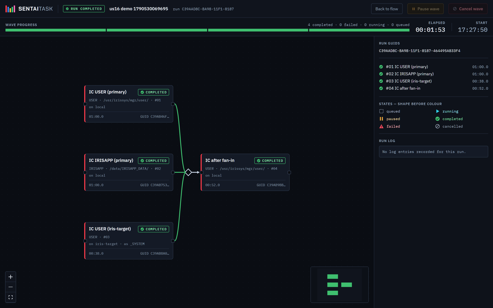

[](https://openexchange.intersystems.com/package/sentai-task)
[](LICENSE)
[](https://www.intersystems.com/)
[](https://docs.intersystems.com/)
[](#-where-sentaitask-uses-embedded-python-and-why)
[](#docker)
[](#ipm)

<p align="center">
  
</p>

# 🦸 SentaiTask 戦隊

**Visual orchestration for InterSystems IRIS maintenance tasks**: compose checks, purges and
journal switches as a flow, run them in parallel waves that converge at join points, on this
instance and on other IRIS servers, and watch every step live.

<p align="center">
  
</p>

## 🚀 Try it

- **Public demo**: a stable address is being set up for the voting week; it will be listed here.
  Sign in as **`sentai-demo`** / **`sentai-demo-2026`**, open **Showcase: nightly checks across
  servers** from *Open flow…* and choose *Run now*. The demo is reset every day.
- **On your machine, in three commands** (Docker only):

  ```sh
  git clone https://github.com/musketeers-br/sentai-task.git && cd sentai-task
  docker compose up -d --build
  # then open http://localhost:52773/csp/sentai/ and sign in as _SYSTEM / SYS
  ```

  The local quickstart works even when the public demo is down. *Open example flow* on the empty
  canvas runs a ready-made, read-only flow in about a second.

### Contest areas covered

| Management Portal area | What SentaiTask offers | Proof |
|---|---|---|
| **Task management** | Flows of tasks with dependencies and fan-in joins; dispatch, live tracking, cancel and rerun per step; native Task Manager catalog with filters, suspend and resume; flow scheduling through the platform | [How to use](#-how-to-use), [spec 006](specs/006-task-catalog-api/) |
| **Operating system** | `storage-headroom-check` (free disk per database and journal directory, Embedded Python) and `db-size-report` (size and free space of every database) as flow steps | [Declared step types](#declared-step-types) |
| **Work Queue Manager** | Read and edit WQM categories, the worker pools every step runs on | [API at a glance](#api-at-a-glance) |
| **Logs** | Each step's state, elapsed time and the platform's failure reason verbatim, streamed over SSE and kept per run | [Known limitations](#%EF%B8%8F-known-limitations-v1) |
| **Permissions** | Every call runs with the operator's own IRIS credential; the platform's refusal is shown verbatim, never reinterpreted | [How it works](#%EF%B8%8F-how-it-works) |
| **Distributed work** | A flow step can run on another IRIS instance (a *target server*), tracked and with its result collected on the primary | [DPI-I-588](#-implements-dpi-i-588-distributed-work-manager) |

---

## 🌌 Motivation

IRIS maintenance jobs such as integrity checks, journal switches, purges and compaction are
usually scheduled one at a time in the Task Manager. Their order, their dependencies and "what
happens if one fails" are kept in someone's head or in a runbook.

Other portals list tasks one by one. **SentaiTask orchestrates them**: it turns that tacit
knowledge into a declared, validated, observable flow:

- ✅ **Compose** a flow as a graph: steps run in parallel waves and fan in at join points.
- ✅ **Validate before running**: cycles, unknown or unsupported step types, missing parameters,
  missing namespaces, unknown WQM categories, read-only databases.
- ✅ **Dispatch and track**: every step becomes a platform job with its own GUID, state and
  verbatim failure reason, followed live on the canvas (the API also streams it over
  Server-Sent Events).
- ✅ **Stay honest**: the product only offers what the target IRIS instance was proven to do (see
  [Known limitations](#%EF%B8%8F-known-limitations-v1)).

Like a *sentai* squad, each step has its own role, and the flow decides when they move together.

---

## 🛠️ How It Works

SentaiTask is an ObjectScript backend on top of the IRIS management API (`/api/admin`), plus a
canvas UI that IRIS serves itself. It does not reimplement the platform's permissions: every
platform call is made with the operator's own credential (Constitution III, *Delegated
Authorization*).

### Core pieces

1. **Flow model** (`sentai.model`): Flow, Step, Edge, Join, Run, StepRun and LogEntry, persisted
   in IRIS. Edges are acyclic and fan-in joins use `ALL_MUST_SUCCEED`.
2. **Step-type registry** (`sentai.registry.StepType`): a closed, compiled catalog. No code is ever
   taken from input. Each type declares whether it is destructive, pausable and **available on the
   target platform**.
3. **Validator** (`sentai.validation.FlowValidator`): a single gate shared by validate, dispatch
   and schedule, so a flow that fails `/validate` can never be run.
4. **Wave dispatcher** (`sentai.dispatch.WaveDispatcher`): creates the Run and one StepRun per
   step in a single transaction, enqueues eligible steps on the step's WQM category, starts the
   platform job and follows it to a terminal state.
5. **REST API + SSE** (`sentai.rest.Dispatcher`): `/csp/sentai/api/v1`, with password + JWT
   authentication and no unauthenticated access.
6. **Declared steps** (`sentai.steps`): in-process step types, compiled classes extending
   `%SYS.Task.Definition`; disk readings use Embedded Python (see
   [below](#-where-sentaitask-uses-embedded-python-and-why)).
7. **Canvas UI** (`frontend/`): SvelteKit + Svelte Flow, compiled to static files in a Node stage
   of the `Dockerfile` and served by IRIS's own web server at `/csp/sentai/` through
   `sentai.web.StaticFiles`, behind the IRIS password (no unauthenticated web app). No Node
   process runs in the shipped container; the page talks only to the two APIs above.

### Architecture overview

```
┌─────────────────────────────────────────────────────────────┐
│                 Operator (curl / canvas UI)                 │
└─────────────────────────┬───────────────────────────────────┘
                          │ Bearer token from /api/admin/login
                          ▼
┌─────────────────────────────────────────────────────────────┐
│            REST  /csp/sentai/api/v1  (sentai.rest)          │
│   flows · validate · dispatch · runs · events (SSE) · wqm   │
└──────────┬──────────────────────────────┬───────────────────┘
           │                              │
           ▼                              ▼
┌──────────────────────┐      ┌───────────────────────────────┐
│   FlowValidator      │◀─────│   WaveDispatcher              │
│   one gate for       │      │   Run + StepRuns (1 tx)       │
│   validate/dispatch/ │      │   waves → %SYSTEM.WorkMgr     │
│   schedule           │      │   (per WQM category)          │
└──────────┬───────────┘      └──────────────┬────────────────┘
           │ categories                      │ start / poll / pause
           ▼                                 ▼
┌─────────────────────────────────────────────────────────────┐
│          IRIS management API  /api/admin  (platform)        │
│   wqm-categories · database-dir/integrity-check ·           │
│   async-result                                              │
└─────────────────────────────────────────────────────────────┘
```

---

## 📋 Prerequisites

- [Git](https://git-scm.com/book/en/v2/Getting-Started-Installing-Git)
- [Docker Desktop](https://www.docker.com/products/docker-desktop) with Docker Compose
- **InterSystems IRIS 2026.2**. The container image built by this repo is the verified target.

---

## 🛠️ Installation

### Docker

```sh
git clone https://github.com/musketeers-br/sentai-task.git
cd sentai-task
docker-compose up -d --build
```

The build compiles the canvas, loads the `sentai-task` module and registers the REST application
`/csp/sentai/api/v1` on **http://localhost:52773**. When the container is up, open

**http://localhost:52773/csp/sentai/**

Sign in to the canvas with your IRIS user (`_SYSTEM` / `SYS` on this dev image). That sign-in
exchanges the password for short-lived API tokens; only the renewal token is kept, for the
current browser tab (spec 010), and the password is never stored.

> **What is public and what is not:** the page itself (HTML, JS, CSS) is served without
> authentication by `sentai.web.StaticFiles`, which only reads the canvas build and holds no
> data. Its code lives in a small database, `SENTAIWEB`, and the app's role `SentaiWebPage` only
> lets the anonymous request enter the namespace (read on its default globals database). Every
> flow and run goes through the REST API, which always requires a token.

### IPM

In an IRIS instance with the IPM client:

```objectscript
USER>zpm "install sentai-task"
```

The app runs immediately; the palette narrows by entry text. For **semantic** search ("describe
the job, get the step type"), install one row in `%Embedding.Config` — in the namespace the module
runs in — and pick the provider that fits the machine. Until a row exists the palette simply
stays on its local filter; everything else works.

**No sidecar at all** — the platform's own in-process provider. Requires Embedded Python with the
`sentence-transformers` package; the `INSERT` itself checks that and downloads the model once, so
a failure names exactly what is missing (`hfCachePath` is where the model lands — pick a writable
directory):

```sql
INSERT INTO %Embedding.Config (Name, EmbeddingClass, Configuration, VectorLength, Description)
VALUES ('sentai-steps', '%Embedding.SentenceTransformers',
        '{"modelName":"sentence-transformers/all-MiniLM-L6-v2","hfCachePath":"/home/irisowner/hf-cache"}',
        384, 'Step-type search, in-process');
```

**Alternatives, all the same one row:** `sentai.search.EmbeddingService` with any
OpenAI-compatible `Configuration` — a local [ollama](https://ollama.com) (it also installs
natively; no container needed) or any server speaking `POST /v1/embeddings` — or
`%Embedding.OpenAI` for a hosted provider, which **sends the operator's query text off the
machine**. Delete the row to drop semantic search again; nothing else changes.

### Public demo (hosts)

A public machine runs the same compose stack behind a proxy that forwards only the canvas and
the management API calls the canvas makes; the management portal and every other web
application answer 404, and IRIS publishes no port of its own (spec 011).

```sh
git clone https://github.com/musketeers-br/sentai-task.git /opt/sentai-task && cd /opt/sentai-task
printf 'SENTAI_DEMO_SECRET=%s
DEMO_HOST=%s
' "<long random secret>" "demo.example.org" > .env
scripts/demo/up.sh
```

- `up.sh` refuses to start without `SENTAI_DEMO_SECRET`. It gives that secret to every privileged
  account on both instances, creates the demo account `sentai-demo` / `sentai-demo-2026` with
  least privilege ([what it may do](specs/011-demo-readiness/evidence/t001-demo-role.md)), seeds
  the example and showcase flows, and only then opens the proxy. With `DEMO_HOST` set the proxy
  obtains an HTTPS certificate for it; without it, the demo answers on plain HTTP.
- The demo account holds no security administration. The platform still lets it purge task
  history, because the privileges an integrity check needs allow that too; on a disposable demo
  this is accepted.
- Keep it clean and watch it (cron on the host):

  ```cron
  0 6 * * *    cd /opt/sentai-task && scripts/demo/reset.sh  >> /var/log/sentai-demo.log 2>&1
  0 */12 * * * cd /opt/sentai-task && scripts/demo/status.sh >> /var/log/sentai-demo.log 2>&1
  ```

  `reset.sh` removes visitor flows and runs, restores the showcase and the demo password, and
  clears the IRIS alert state on both instances; `status.sh` exits non-zero when an instance is
  unhealthy.
- Never `docker compose down` the demo (it removes the containers and their data): use
  `restart`, or run `up.sh` again to rebuild, re-secure and re-seed.

---

## 💡 How to Use

### On the canvas

1. **Compose.** Drag an available step type (*Integrity check*, *Switch journal*, *Storage
   headroom check*, *Database size report*, *Purge task history*) from the palette onto the canvas (the others are
   listed but marked *not supported in v1*, see [Known limitations](#%EF%B8%8F-known-limitations-v1)).
   Drag from a step's right handle to another step's left handle to connect them; edges that would
   create a cycle are refused as you draw. Several edges into one step meet at a single diamond:
   that step waits for all of them. Click a step to edit it in the inspector, then **Save flow**.
   Declared steps (*Switch journal*, *Purge task history*, *Storage headroom check*, *Database size
   report*) sit in the palette's **Custom** group; their inspector form is generated from the
   parameter schema the API declares, shows each default as a placeholder, and puts a validation
   error on the field it concerns.
2. **Validate flow.** Errors (unknown namespace or category, unsupported type, missing parameter)
   appear on the affected node and block running; warnings, such as a read-only database, are
   shown but do not block.
3. **Run now.** You are asked for your password once: the run gets its own sign-in and renews its
   credential by itself for as long as it runs. The password is not kept. A destructive step also
   asks you to type the database directory (or namespace) it acts on; the backend checks the value
   and, if it does not match, its answer is shown as is.
4. **Watch.** The live-run view shows each step's state, elapsed time and, if it fails, the
   platform's own failure message. Cancel one step without touching the others, or *Cancel wave*
   for the whole run.

The **Dark / Light** switch in the top bar changes theme on every screen.

### The Task catalog screen

**Task catalog** in the top bar shows the platform's Task Manager: every scheduled task on the
instance, not only SentaiTask's (spec `007-canvas-management-screens`, over the spec 006 API).

- **Only the platform's values.** Class, run-as user, next and last run, status and suspended are
  shown as the API returns them. A value the platform refused to read says *unavailable*, with the
  platform's reason; nothing is filled in. Rows are sorted by next run.
- **Filters are the API's.** Search, namespace, *All / Scheduled / Suspended* and *Destructive
  only* are sent to the API, and "N of M tasks" is its count.
- **Detail and origin.** Click a task for every field plus its recent runs. A task SentaiTask
  scheduled is marked *SentaiTask · flow 1 · step 01*, and its detail links to that flow on the
  canvas, or says *flow not found* when the flow is gone.
- **Suspend / Resume.** The one that applies is offered; the platform decides, and a refusal is
  shown as the platform worded it (for example `HTTP 403 — no reason given` without
  `%Admin_Task`).
- **Addressable.** `?view=catalog&task=4` opens a task's detail directly; back and forward work.


### Target servers from the canvas (DPI-I-588)

**Targets** in the top bar manages the other IRIS instances a step can run on (spec
`009-canvas-distributed-targets`, over the spec 008 API):

- **Register** a target (name, `https://host:port` address, description), edit, delete, and switch
  it online or offline. Every refusal is shown as the API worded it.
- **Live state.** Type your password for the target and *Read state*: its IRIS version and Work
  Queue Manager categories, as the target reports them — or *unreachable* with the transport
  error. The password and the target's tokens are used for that one read and not kept.
- **Run on.** In the inspector, an integrity check can run on *Local* or any online target; the
  node then carries the target's name. Step types that cannot run remotely say so.
- **Run now** asks one more password per target the flow uses. The live run shows where each step
  runs (*on local*, *on iris-target*) and as whom.


### With the API

#### 1. Get a token

The API uses the same 60-second JWT as the IRIS management API:

```sh
TOKEN=$(curl -s -X POST -u _SYSTEM:SYS http://localhost:52773/api/admin/login | jq -r .access_token)
```

#### 2. Compose a flow

Two integrity checks run in parallel and fan in to a third:

```sh
curl -s -X POST http://localhost:52773/csp/sentai/api/v1/flows \
  -H "Authorization: Bearer $TOKEN" -H "Content-Type: application/json" \
  -d '{
    "schemaVersion": 1,
    "name": "nightly-checks",
    "defaultCategory": "Default",
    "steps": [
      {"id": "01", "type": "integrity-check", "taskName": "IC USER",    "namespace": "USER",    "wqmCategory": "Default"},
      {"id": "02", "type": "integrity-check", "taskName": "IC IRISAPP", "namespace": "IRISAPP", "wqmCategory": "Default"},
      {"id": "03", "type": "integrity-check", "taskName": "IC %SYS",    "namespace": "%SYS",    "wqmCategory": "Default"}
    ],
    "edges": [ {"source": "01", "target": "03"}, {"source": "02", "target": "03"} ],
    "joins": [ {"target": "03", "policy": "ALL_MUST_SUCCEED"} ]
  }'
```

#### 3. Validate, dispatch and watch

```sh
curl -s -X POST http://localhost:52773/csp/sentai/api/v1/flows/<flowId>/validate  -H "Authorization: Bearer $TOKEN"
# {"errors":[],"warnings":[]}

curl -s -X POST http://localhost:52773/csp/sentai/api/v1/flows/<flowId>/dispatch  -H "Authorization: Bearer $TOKEN" \
  -H "Content-Type: application/json" -d '{"confirmations": []}'
# 202 {"guid": "<runGuid>", "state": "running", ...}

curl -N http://localhost:52773/csp/sentai/api/v1/runs/<runGuid>/events -H "Authorization: Bearer $TOKEN"
# event: step-state-changed ... event: run-terminal
```

Steps 01 and 02 start together. Step 03 stays `queued` until both complete.

A run dispatched like this keeps the 60-second token it was given. To let it run longer, sign in
separately for the run and add that sign-in's refresh token to the body,
`"runCredential": {"refreshToken": "…"}`, while sending its access token in `Authorization`. The
run then renews its own credential and erases it when it ends. The canvas does this for you.

#### API at a glance

| Area | Endpoints |
|---|---|
| Flows | `GET/POST /flows` · `GET/PUT /flows/{id}` · `POST /flows/{id}/validate` · `POST /flows/{id}/dispatch` · `POST /flows/{id}/schedule` |
| Runs | `GET /runs` · `GET /runs/{guid}` · `GET /runs/{guid}/events` (SSE) · `POST /runs/{guid}/cancel` · `POST /runs/{guid}/pause` |
| Steps | `POST /runs/{guid}/steps/{stepGuid}/cancel` · `…/pause` · `…/rerun` |
| Catalog | `GET /catalog/step-types` · `GET /catalog/step-types/search?q=…` · `GET /catalog/tasks` · `GET /catalog/tasks/{id}` · `POST /catalog/tasks/{id}/suspend` |
| WQM | `GET /wqm/categories` · `GET/PUT /wqm/categories/{name}` |
| Targets | `GET/POST /targets` · `GET/PUT/DELETE /targets/{name}` · `POST /targets/{name}/online` · `POST /targets/{name}/sign-in` · `GET /targets/{name}/status` |

Validation errors come back as `{"errors": [{"stepId", "code", "message"}], "warnings": [...]}`,
with codes such as `CYCLE_DETECTED`, `STEP_TYPE_NOT_SUPPORTED_ON_TARGET`, `CATEGORY_NOT_FOUND`
and, for declared step types, `PARAM_REQUIRED`, `PARAM_TYPE_MISMATCH`, `PARAM_OUT_OF_RANGE`,
`PARAM_UNKNOWN` (each also carries `parameter`) and, on `/schedule`, `IN_PROCESS_NOT_SCHEDULABLE`.

#### Declared step types

Besides `integrity-check` (run through the platform's management API), some step types are
**declared**: an entry in the closed catalog (`XData Catalog` in `sentai.registry.StepType`,
`executor: "in-process"`) names a class extending `%SYS.Task.Definition` and the schema of the
parameters it takes. A step of that type runs the class's `OnTask()` on a Work Queue Manager worker
of the step's category, inside IRIS.

| Type | Class | Parameters | Notes |
|---|---|---|---|
| `storage-headroom-check` | `sentai.steps.StorageHeadroomCheck` | `minFreePercent` number 0–100, default 10 | Read-only. Fails when a database directory or the journal directory has less free disk than the threshold, naming each location and its free %. Embedded Python (`shutil.disk_usage`). |
| `db-size-report` | `sentai.steps.DatabaseSizeReport` | — | Read-only. `result.databases` lists every database with `sizeMB` and `freeMB` (`%SYS.DatabaseQuery:FreeSpace`). |
| `switch-journal` | `%SYS.Task.SwitchJournal` | — | Starts a new journal file. Needs `%Admin_Operate:USE`; without it the platform's `#921` text is the failure reason. |
| `purge-task-history` | `%SYS.Task.PurgeTaskHistory` | `keepDays` integer ≥ 0, default 30 | Destructive (typed confirmation, not schedulable). Available since the canvas asks for the typed confirmation at *Run now* (spec 007 T009). |

- **Adding one** is a code change reviewed in a pull request: write the class (extending
  `%SYS.Task.Definition`, optionally with a `Result` property holding JSON text) and add one catalog
  entry with its `parameters`. Nothing an operator types ever selects code: the class comes from
  the catalog by the step's `type`, properties are set by iterating the declared schema, and a
  legacy `custom` step's `customClass` is never read on any execution path.
- **Identity.** A declared step runs **as the operator who dispatched the run**: the worker takes
  the identity of the run loop that queued it. The platform decides, at that moment, whether that
  operator may do the work, and its refusal is the step's failure reason, verbatim. Each step shows
  who ran it in `executedAs` (`GET /runs/{guid}` → `steps[]`). A run has one identity:
  `/dispatch` with a `runCredential` of another user is refused with 403
  `RUN_CREDENTIAL_USER_MISMATCH` before any run exists, and only the dispatcher may re-run a step
  (403 `RERUN_NOT_BY_DISPATCHER`). Declared steps are not schedulable
  (`IN_PROCESS_NOT_SCHEDULABLE`): a scheduled run has no operator.
- **Timeout.** `timeoutMinutes` (60 when 0) counts from the moment the step becomes `running`,
  which includes the time spent waiting for a worker under the category's limits. A timed-out or
  cancelled step's work may still finish in the background; its late result is discarded.
- **Result.** A class's `Result` is shown as `result` in the run read (`{}` when none), at most
  8000 characters: a larger report keeps the first elements of its largest list and adds
  `"truncated": true, "omitted": <n>`.

#### 🔎 Semantic step-type search and the embedding provider

The palette's search box also accepts a sentence — "free up disk space", "rotate the journal" —
and offers the closest catalog entries first, above today's list. The ranking is cosine similarity
between the query's embedding and the description each catalog entry carries, so what a
capability is *for* in the operator's terms is what makes it findable.

Try it in the palette's search box: type the **job**, not the tool's name — the closest entries
appear under **SUGGESTED** within a beat of the last keystroke (scores below as measured on the
dev stack's `all-minilm`; `q` is the query, `matches` rank best-first and only what clears the
0.20 floor):

| You type | SUGGESTED offers first |
|---|---|
| `free up disk space` | Storage headroom check (0.59), Compact globals (0.49) |
| `get rid of old audit records` | Purge audit records (0.71), Purge task history (0.33) |
| `rotate the journal` | Switch journal (0.55) |
| `check my globals are sound` | Integrity check (0.47) |

The same query over the API:

```sh
curl -s -H "Authorization: Bearer $TOKEN" --get \
  --data-urlencode 'q=free up disk space' \
  http://localhost:52773/csp/sentai/api/v1/catalog/step-types/search
# {"available":true,"matches":[{"type":"storage-headroom-check","score":0.59}, …]}
```

Two answers that look empty but are working correctly: `order me a pizza` answers
`{"available":true,"matches":[]}` — nothing in the catalog is close, and below the floor the
palette offers nothing rather than something wrong; and a lone keyword like `structure` stays
below the floor too (one word against nine full sentences) — **intent sentences are the semantic
path, keywords are today's substring path** (which keeps working underneath: typing `journal`
still narrows to Switch journal on every keystroke, before any request).

The embedding provider is **a row in the platform's `%Embedding.Config` table, never code**. With
no row at all the app runs exactly as before — search narrows by entry text, and nothing about the
palette changes (that is also the state CI runs in). On the dev stack this row is **installed by the build** (`iris-provider.script`), so
`docker compose up -d` comes up with search working and nothing manual; delete the row to run the
stack without a provider, and it stays deleted until the next image rebuild.

One row, in `IRISAPP`, is the whole setup:

```sql
INSERT INTO %Embedding.Config (Name, EmbeddingClass, Configuration, VectorLength, Description)
VALUES ('sentai-steps', 'sentai.search.EmbeddingService',
        '{"host":"ollama","port":11434,"https":0,"path":"/v1/embeddings","model":"all-minilm"}',
        384, 'Step-type search, local Ollama');
```

`Configuration` is the provider endpoint, in JSON: `host`, `port`, `https` (`0`/`1`), `path` (the
OpenAI-compatible `POST` route, normalized onto a leading slash), `model`, and an optional `apiKey`
(sent as `Authorization: Bearer …` only when present). Nothing is hardcoded: the dev stack serves
`all-minilm` on the compose network's `ollama` service, and the row's validating trigger rejects a
configuration missing `host`, `path` or `model` at insert time, with the platform's own message.

**Pointing at a different provider is a row change, not a code change.** The table names the class:
`%Embedding.SentenceTransformers` or `%Embedding.OpenAI` are rows in the same table with their own
`Configuration`, and `sentai.search.EmbeddingService` itself speaks the OpenAI-compatible shape
any such provider serves.

> **A hosted provider sends the operator's query text off the machine.** What you type into the
> palette's search box travels, as the request body, to whatever host the row names. A local
> provider keeps it on the compose network; a hosted one does not — that is the trade-off, and it
> belongs to whoever writes the row. If the provider is unconfigured, unreachable, too slow, or
> returns vectors the stored corpus cannot compare with, the answer is today's palette — no error,
> no toast, and never a masquerading "no results".

#### 🐍 Where SentaiTask uses Embedded Python, and why

`sentai.steps.StorageHeadroomCheck` reads the free disk of every database directory and of the
journal directory with Python's `shutil.disk_usage`. Asking the filesystem how much room is left
is Python's natural job, and it works the same on every OS IRIS runs on. What is IRIS's own stays
in ObjectScript: the list of directories comes from the platform, the threshold comparison and the
`%Status` contract are ObjectScript, and a failure names each location with its free percentage.

It is a real step, not a demo: put it at the head of a nightly flow and the integrity checks behind
it only start when there is room for them.

#### The task catalog: the platform's Task Manager, as the platform reports it

`GET /catalog/tasks` lists every scheduled task on the instance, not only SentaiTask's. Every value
is the platform's own, read with **your** token. Anything the platform did not report is absent;
nothing is filled in (spec `006-task-catalog-api`).

```sh
curl -s "http://localhost:52773/csp/sentai/api/v1/catalog/tasks?q=integrity&filter=suspended" \
  -H "Authorization: Bearer $TOKEN"
# {"total": 22, "matched": 1, "items": [{"taskId": 4, "name": "Integrity Check", "namespace": "%SYS",
#   "class": "%SYS.Task.IntegrityCheck", "runAsUser": "_SYSTEM", "timePeriod": "Weekly",
#   "nextRun": "2026-09-28 02:00:00", "lastStarted": "", "lastFinished": "", "status": "1",
#   "lastError": "", "suspended": true, "destructive": false, "destructiveUnknown": false, ...}]}
```

**Where each value comes from.** The platform's management API: the list read says which tasks
exist; the single read gives `class`, `runAsUser` and `timePeriod`; the info read gives `status`,
`lastError`, `lastStarted`, `lastFinished`, `nextRun` and `suspended`. The item read
(`/catalog/tasks/{id}`) also returns `recentRuns`.

- The in-process path (`%SYS.Task` objects) is deliberately not used. On IRIS 2026.2 it does not
  check `%Admin_Task`: a user without that privilege could read every task and suspend one, while
  the management API refuses the same user with 403.
- The platform's list read is lossy, so it is never used for values. It reports every suspended
  task as `Suspended: false`, and it truncates `NextScheduled` to minutes (`"Runs After #1:00"`
  for run-after tasks).

**Reading the values.**

| Field | What it means |
|---|---|
| `status` | `"1"` means OK. After a failed run, it is the platform's own error text for its stored status, the same text as the portal and the history show |
| `lastError` | The platform's `Error` field verbatim. It reads `"Success"` after a successful run and is empty after a failed one; the failure text is in `status` |
| `nextRun` | Verbatim, and `""` when the platform has none (for example a run-after task; see `timePeriod`). A suspended task keeps its `nextRun` |
| `destructive` / `destructiveUnknown` | From the step-type catalog only. A class the catalog does not name is `destructiveUnknown: true`, never a guess. SentaiTask's own scheduled tasks take it from the step they run |
| `origin` | `{flowId, stepId, flowExists}` on tasks named `SentaiTask: <flowId>#<stepId>` (the product's generator) |
| `unavailable` | Lists the fields a failed per-task read would have given, with the platform's HTTP status and its `status` object verbatim |
| `recentRuns` | Item read only: up to 5 executions from the platform's history, with its own keys. There is no duration, because the platform's precision is minutes |

`isDestructive` and `lastRun` remain as deprecated aliases of `destructive` and `lastFinished`.

**Filters.** `q` (name or class, case-insensitive), `namespace`, `filter=all|scheduled|suspended`
("scheduled" means not suspended) and `destructiveOnly=0|1|true|false`. A task whose
destructiveness is unknown is excluded by `destructiveOnly`. Other values → 400 `INVALID_FILTER`.
`total` and `matched` give "N of M".

**Suspend and resume.** `POST /catalog/tasks/{id}/suspend` with `{"suspended": true|false}` calls
the platform's `task/suspend` or `task/resume`, then reads the task again.

- The answer is 200 with the task as re-read.
- The platform answers 200 even when its suspend fails internally, so if the re-read shows the old
  state the answer is 502 `SUSPEND_NOT_APPLIED`, with the platform's read attached.

**Privilege and refusals.** The operator needs `%Admin_Task` for reads and for suspend/resume.
That `%Admin_Operate` alone is enough for reads is only what the platform's source suggests; it
was not proven.

- A refusal comes back with the platform's HTTP status and its `status` object as
  `platformStatus`.
- On 2026.2 a 403 carries no reason, and none is added.

---

## 🌐 Implements DPI-I-588 (Distributed Work Manager)

InterSystems Ideas [DPI-I-588 "Distributed Work Manager"](https://ideas.intersystems.com/ideas/DPI-I-588)
asks for work dispatched in the background to any reachable IRIS server — for example an async or
failover mirror member — with status checks, results collected on the primary, and management of
each target. SentaiTask implements it inside its existing model (spec
[`008-distributed-targets`](specs/008-distributed-targets/spec.md)): **a flow step can name a
target server**, and the run follows it exactly as it follows a local step.

```sh
# 1. Register the target (the compose stack ships one: iris-target)
curl -X POST -H "$H" -d '{"name":"iris-target","baseUrl":"http://iris-target:52773"}' $API/targets
# 2. Sign in to it through the primary — returns the target's own token pair, keeps nothing
curl -X POST -H "$H" -d '{"user":"_SYSTEM","password":"…"}' $API/targets/iris-target/sign-in
# 3. Its state and load, as the target reports them
curl -H "$H" -H "X-Sentai-Target-Authorization: Bearer <target access token>" $API/targets/iris-target/status
# 4. A step with "target": "iris-target"; dispatch with one credential per target used
#    ... "targetCredentials": [{"target": "iris-target", "refreshToken": "<target refresh token>"}]
```

**What is implemented**

- **Remote dispatch.** A step on a target starts its job on that instance's management API and is
  followed with the same states and live events; each step run says where it ran (`executedOn`).
  Proven with the demo flow — two integrity checks on the primary and one on `iris-target`, fanning
  in — whose remote report names the target machine
  ([evidence](specs/008-distributed-targets/evidence/t008-demo-run.json)).
- **Results on the primary.** The job's own report is kept as the step's `result`.
- **Targets and their state.** Register, edit, delete; a live status read (reachable, IRIS version,
  Work Queue Manager categories and their worker configuration, as the target reports them); an
  operator-set *online/offline* flag — an offline target is refused at validation and dispatch.
- **Control.** Cancel and pause are forwarded to the instance running the job.
- **Failures as values.** `TARGET_NOT_FOUND`, `TARGET_OFFLINE`, `TARGET_UNREACHABLE` (transport
  error verbatim), `TARGET_REFUSED`, `STEP_TYPE_NOT_REMOTE_CAPABLE`, `TARGET_CREDENTIAL_MISSING`,
  `TARGET_CREDENTIAL_USER_MISMATCH`. A target that stops answering mid-run fails only its step,
  after the step's timeout, with the last transport error.

**What is deliberately different**

- **A closed catalog, no arbitrary code.** The idea mentions calling any method or `$$` function
  remotely. SentaiTask does not: only step types from its declared catalog run on a target, and no
  code, method or class name is ever taken from input (Constitution II).
- **The operator's own credential per target.** There is no service account and no stored
  password: the operator signs in to each target used by a flow; the credential lives only for the
  run, in non-persistent storage, and is erased at its end. The target alone decides what the
  operator may do there.
- **Placement is the operator's.** Each step names its target; nothing is placed automatically.

**What is future**

- Declared in-process steps on a target (they need SentaiTask installed there).
- Discovering targets from the mirror configuration and their mirror role.
- Callbacks from the target; load-based placement.
- A queue length per category: the platform's management API does not report one today
  ([T001 evidence](specs/008-distributed-targets/evidence/t0-summary.md)).

---

## ⚠️ Known limitations (v1)

SentaiTask v1 only promises what was proven on IRIS 2026.2 (spec `004-backend-hardening`). The
main points:

- **Available step types:** `integrity-check`, `switch-journal`, `storage-headroom-check`,
  `db-size-report` and `purge-task-history` (destructive: typed confirmation). The others are listed with `available: false` and refused with
  `STEP_TYPE_NOT_SUPPORTED_ON_TARGET` until each one is proven.
- **Use manual dispatch.** `/schedule` validates the flow and registers native tasks, but a
  scheduled run has no operator credential in v1, so it is not a supported execution path yet.
- **Long runs need a run credential.** The canvas handles it at *Run now*; a plain `curl` dispatch
  without `runCredential` stops after the platform's 60-second token.
- **Flows must name an existing WQM category**, such as `Default`.
- **Validating needs `%Admin_Manage:USE` and read on IRISSYS**; the platform decides the rest.
- **Remote steps (DPI-I-588):** only types run through the management API (`integrity-check`);
  targets must be `https` unless loopback — the compose demo allows `http` on its own network only.

The complete list, with the reasons behind each point, is in
[`docs/limitations.md`](docs/limitations.md).

---

## 🧪 Running the tests

```sh
docker exec -it sentai-task-iris-1 iris session iris -U IRISAPP
```

```objectscript
IRISAPP>zpm "load /home/irisowner/dev"
IRISAPP>zpm "test sentai-task -only"
```

The suite (`sentai.unittest.*`, 268 methods) runs against a test double of the management API, so
it never starts real platform jobs through the admin API.

Some tests ask the Work Queue Manager for a category that does not exist, on purpose, to check
that the step fails with the platform's own message. IRIS logs each of those refusals at severity
2, which puts the instance in the *alert* state, so Docker then reports the container as
`unhealthy` (its healthcheck accepts only `ok` and `warn`). **Cancelling a running step does the
same:** SentaiTask forwards the cancel to the platform (`async-result/cancel`), and IRIS 2026.2 ends
the job's worker, which its Work Queue Manager logs as `ERROR #7802 … unexpectedly shut down`
(severity 2) — a plain IRIS with nothing installed logs it too
([evidence](specs/008-distributed-targets/evidence/t0-summary.md)). SentaiTask does not clear the
alert itself, since that would hide real ones. After running the suite, or cancelling steps, on an
instance you keep using, clear the state:

```objectscript
%SYS>do $SYSTEM.Monitor.Clear()
```

The canvas has unit tests and end-to-end acceptance tests (these need Node 20+ on your machine and
the container running):

```sh
cd frontend
npm ci
npm test                    # unit tests (vitest)
npx playwright install chromium
npm run test:e2e            # acceptance tests against http://localhost:52773
```

The acceptance tests drive real runs, so they take about six minutes; screenshots and captures
land in [`specs/002-canvas-ui/evidence/`](specs/002-canvas-ui/evidence/) and
[`specs/007-canvas-management-screens/evidence/`](specs/007-canvas-management-screens/evidence/).
Some catalog tests create a temporary IRIS user through `docker exec` (container
`sentai-task-iris-1`, or `SENTAI_CONTAINER`) and delete it at the end. After changing the
frontend, `bash scripts/publish-canvas.sh` copies a fresh build into the running container.

---

## 🗂️ Project Structure

```
sentai-task/
├── src/sentai/
│   ├── model/          # Flow, Step, Edge, Join, Run, StepRun, Category, LogEntry
│   ├── registry/       # StepType: closed catalog (destructive / pausable / available)
│   ├── validation/     # FlowValidator: the single gate
│   ├── dispatch/       # WaveDispatcher, AdminApiClient, ScheduledFlowTask
│   ├── steps/          # Declared in-process steps (StorageHeadroomCheck uses Embedded Python)
│   ├── wqm/            # CategoryService: WQM read/write passthrough
│   ├── catalog/        # TaskService: native Task Manager catalog
│   ├── rest/           # Dispatcher: REST API + SSE
│   └── web/            # StaticFiles: serves the canvas build
├── tests/sentai/unittest/   # %UnitTest suites + AdminApiDouble
├── frontend/           # Canvas UI: SvelteKit + Svelte Flow, built to static files
├── docs/             # Full known-limitations list
├── design/             # Canvas UI prototypes (spec 002)
├── specs/              # Spec-driven history: 001 contract spike → 007 management screens
├── scripts/sanitation/ # Reviewed cleanup of historical test residue
├── module.xml
└── docker-compose.yml
```

---

## 📊 Roadmap

### ✅ Done

* [x] **001**: Contract spike against the real IRIS management API ([compatibility statement](specs/001-validate-async-job-contract/compatibility.md))
* [x] **003**: ObjectScript backend: persistence, validation, wave dispatch, SSE tracking
* [x] **004**: Hardening. The product only promises what IRIS 2026.2 proved.
* [x] **002**: Canvas UI: compose, validate, schedule, run and watch flows, in dark and light
* [x] Runs renew their own credential when dispatched with `runCredential` (runs > 60 s work)
* [x] **005**: Declared in-process steps: storage headroom (Embedded Python), database size report, journal switch
* [x] **006**: Task catalog API: the native Task Manager as the platform reports it, with suspend and resume
* [x] **007 (part A)**: Task catalog screen (list, filters, detail, SentaiTask origin, suspend/resume) and the typed confirmation before dispatching a destructive step
* [x] **007 (part B)**: declared custom steps in the canvas: a *Custom* palette group and an inspector form generated from the API schema, with errors on their field
* [x] **008**: Distributed targets — implements [DPI-I-588](https://ideas.intersystems.com/ideas/DPI-I-588) (API)
* [x] **009**: Target servers in the canvas: Targets screen, *Run on*, target passwords at *Run now*, where each step runs
* [x] **010**: Onboarding: *Open flow…*, *Save as…*, sign-in kept across reloads, a ready-made example flow and a getting-started guide
* [x] **011**: Demo readiness: a public demo that stays up (proxy, secured accounts, least-privilege demo account, daily reset), this README's first screen, and a warning before a cancel that makes IRIS raise an alert

### 🚧 Next

* [ ] **012**: Run log and run history: every run tells its own story, and past runs are one click away
* [ ] **013**: Area report steps: security posture, web applications, system alerts and secrets as flow steps, on any server
* [ ] **014**: Demo media and community article (English and Portuguese)
* [ ] **015**: Scheduled runs that execute, with the run-as credential kept in the IRIS Wallet
* [ ] WQM category screen in the canvas (the API already has it)
* [ ] Prove and enable the remaining step types, one at a time

---

## 🎖️ Credits

SentaiTask is developed with 💜 by the **Musketeers Team**:

- [José Roberto Pereira](https://community.intersystems.com/user/jos%C3%A9-roberto-pereira-0)
- [Henry Pereira](https://community.intersystems.com/user/henry-pereira)
- [Henrique Dias](https://community.intersystems.com/user/henrique-dias-2)


---

## 📄 License

This project is licensed under the [MIT License](LICENSE).

---

## 🎬 Bonus: Musketeers Sentai

When the flow validates clean, the squad suits up.


